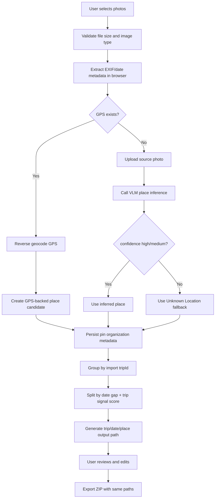

# TripSort 정렬 기술 흐름

이 문서는 TripSort가 여러 장의 여행 사진을 받아서 `여행 -> 일자/지역 -> 파일명` 구조로 정리하는 기술 흐름을 설명한다.

여기서 말하는 정렬은 화면 목록의 정렬 순서가 아니라, ZIP으로 내보낼 최종 폴더/파일 경로를 만드는 과정이다.

```text
source photos
  -> metadata extraction
  -> date/place candidates
  -> trip grouping and splitting
  -> reviewable output paths
  -> ZIP export
```

## 현재 구현 범위

현재 TripSort는 다음 기능을 구현한다.

- JPG, JPEG, PNG, HEIC, WEBP 가져오기
- EXIF 날짜/GPS 추출
- GPS 사진은 Nominatim reverse geocoding으로 장소 후보 생성
- GPS가 없는 사진은 Ollama `llama3.2-vision` VLM으로 장소 후보 생성
- VLM 결과가 `high` 또는 `medium` confidence일 때만 장소 후보로 채택
- VLM 결과에서 city/country/landmark/sceneType trip signal 추출
- 브라우저 import 1회마다 `tripId` 부여
- 같은 `tripId` 안에서도 촬영 날짜 간격과 trip signal scoring으로 별도 여행 자동 분리
- 여행 폴더명 자동 생성
- 여행 폴더명, 날짜, 장소, 파일명 수동 수정
- 미리보기 경로와 동일한 ZIP export
- ZIP export 시 원본 이미지 bytes 보존

## 데이터 입력

| 입력 | 출처 | 사용 목적 |
| --- | --- | --- |
| 원본 파일명 | Browser `File.name` | 기본 파일명, VLM 보조 힌트 |
| 원본 폴더 경로 | `File.webkitRelativePath` | VLM 보조 힌트 |
| MIME type / size | Browser `File.type`, `File.size` | source photo metadata |
| file lastModified | Browser `File.lastModified` | 날짜 fallback |
| EXIF date | `DateTimeOriginal`, `DateTime` | 1순위 촬영일 |
| EXIF GPS | latitude/longitude | 1순위 장소 신호 |
| reverse geocode | `/reverse-geocode` | GPS 기반 장소명 |
| VLM place inference | `/infer-place` | GPS 없는 사진의 장소 후보와 trip signal |
| user edits | organization preview form | 최종 override |

## 전체 흐름



## 날짜 결정

날짜 후보는 브라우저에서 결정한다.

우선순위:

1. EXIF `DateTimeOriginal`
2. EXIF `DateTime`
3. Browser file `lastModified`
4. `Unknown Date`

폴더 경로에 쓰는 신뢰 가능한 날짜 형식은 다음과 같다.

```text
YYYY-MM-DD
```

`Unknown Date` 또는 다른 비표준 문자열은 여행 기간 계산에는 쓰지 않고, 세부 폴더 fallback으로만 사용한다.

## 장소 결정

### GPS가 있는 사진

GPS가 있으면 장소 후보는 GPS가 1순위다.

1. 브라우저가 EXIF GPS를 추출한다.
2. 프론트엔드가 `GET /reverse-geocode?lat=...&lng=...`를 호출한다.
3. 백엔드가 Nominatim을 호출한다.
4. 장소명 우선순위는 `city -> town -> village -> county -> state -> country -> lat,lng`다.

GPS 기반 장소는 장소가 해석되면 `high` confidence로 저장한다.

### GPS가 없는 사진

GPS가 없어도 사진은 정렬 대상에서 제외하지 않는다.

1. 브라우저가 원본 사진을 업로드한다.
2. 프론트엔드가 `POST /infer-place`를 호출한다.
3. 백엔드는 Ollama에 `llama3.2-vision` 모델이 있는지 확인한다.
4. 이미지, 원본 파일명, 원본 폴더명을 함께 넣어 장소 후보를 요청한다.
5. 응답은 JSON이어야 한다.

예시:

```json
{
  "place": "N Seoul Tower",
  "city": "Seoul",
  "country": "South Korea",
  "landmark": "N Seoul Tower",
  "sceneType": "city skyline",
  "confidence": "medium",
  "reason": "Visible tower and skyline."
}
```

채택하는 confidence:

```text
high
medium
```

채택하지 않는 값:

```text
low
unknown
unavailable
missing model
request failure
parse failure
```

VLM은 GPS가 없는 사진의 장소 후보와 trip signal을 만든다. VLM이 최종 여행 그룹을 직접 결정하지는 않는다. 여행 분리는 EXIF 날짜와 VLM trip signal을 deterministic scoring으로 비교해서 결정한다.

## Organization Metadata

각 사진은 source metadata와 organization metadata를 가진다.

Source photo metadata:

```json
{
  "originalFilename": "IMG_0001.jpg",
  "storedFilename": "server-file.jpg",
  "mimeType": "image/jpeg",
  "fileSize": 123456,
  "importedAt": "2026-05-11T00:00:00.000Z"
}
```

Organization metadata:

```json
{
  "tripId": "trip-...",
  "tripGroupId": "manual-trip-...",
  "tripName": "Jeju Spring 2026",
  "candidateCaptureDate": "2026-05-01",
  "candidatePlace": "Jeju City",
  "candidateFilename": "optional-user-edit.jpg",
  "tripSignals": {
    "city": "Seoul",
    "country": "South Korea",
    "landmark": "N Seoul Tower",
    "sceneType": "city skyline",
    "confidence": "medium",
    "reason": "Visible tower and city skyline.",
    "source": "vlm"
  },
  "confidence": "high",
  "reason": "Place candidate came from EXIF GPS reverse geocoding.",
  "status": "ready",
  "outputPath": "Jeju Spring 2026/2026-05-01_Jeju City/IMG_0001.jpg"
}
```

`tripGroupId`, `tripName`, `candidateFilename`은 optional이다. `tripGroupId`가 있으면 자동 scoring보다 우선하는 수동 여행 그룹으로 취급한다. `tripName`이 없으면 자동 생성 규칙을 사용한다.

## 여행 자동 묶기와 분리

TripSort는 세 단계로 여행을 만든다.

1. import session 기준 묶기
2. 촬영 날짜 간격 + trip signal scoring 기준 자동 분리
3. 사용자의 수동 그룹 보정

### 1. import session 기준 묶기

브라우저에서 한 번에 선택한 파일 묶음은 같은 `tripId`를 받는다.

```text
trip-<timestamp>-<random>
```

이 값은 “사용자가 같은 작업으로 넣은 사진들”이라는 1차 힌트다.

### 2. 날짜 간격 + trip signal scoring 기준 분리

같은 `tripId` 안의 사진도 날짜 간격이 너무 크거나, VLM trip signal이 다른 국가/도시를 강하게 가리키면 여러 여행으로 나눈다.

현재 규칙:

```text
known capture date 기준 정렬
이전 사진과 다음 사진의 split score 계산
score >= 4이면 새 여행 세그먼트 시작
```

현재 score:

| Signal | Score |
| --- | ---: |
| known capture date gap > 3 days | +4 |
| accepted country signal changed | +5 |
| accepted city signal changed | +3 |
| accepted city and country are both the same | -4 |

accepted trip signal confidence:

```text
high
medium
```

예시:

```text
2026-05-01 Jeju
2026-05-02 Seogwipo
2026-05-10 Tokyo
```

결과:

```text
Trip_2026-05-01_to_2026-05-02_Jeju City/
Trip_2026-05-10_Tokyo/
```

`2026-05-01`부터 `2026-05-04`까지는 차이가 3일이므로 같은 여행으로 유지된다.

signal 예시:

```text
2026-05-01 Seoul, South Korea
2026-05-02 Tokyo, Japan
```

날짜 차이는 작아도 country signal이 바뀌므로 별도 여행으로 분리된다.

반대 예시:

```text
2026-05-01 Seoul, South Korea
2026-05-08 Seoul, South Korea
```

날짜 차이는 크지만 city/country signal이 같으므로 같은 여행으로 유지된다.

Unknown-date 사진 처리:

- 같은 그룹에 known-date 세그먼트가 있으면 첫 번째 세그먼트에 붙인다.
- 모든 사진이 unknown-date이면 하나의 `Trip_Unknown Date_...` 여행으로 둔다.

### 3. 수동 그룹 보정

preview에서 사용자는 자동 결과를 보정할 수 있다.

- `Merge previous`: 현재 여행 그룹과 바로 앞 여행 그룹을 같은 `tripGroupId`로 묶는다.
- `Split here`: 같은 여행 그룹 안에서 해당 사진부터 새 `tripGroupId`로 나눈다.

`tripGroupId`가 저장된 사진은 backend preview와 ZIP export에서도 자동 scoring을 건너뛰고 수동 그룹을 따른다.

## 여행 폴더명 생성

여행 폴더명 우선순위:

1. 사용자가 입력한 `organization.tripName`
2. 자동 생성한 `Trip_<date-range>_<place>`

자동 이름은 다음 값으로 만든다.

```text
Trip_<여행 시작일_to_종료일>_<대표 장소>
```

대표 장소는 세그먼트 안에서 가장 많이 등장한 장소를 사용한다. 동률이면 먼저 등장한 장소를 사용한다.

예시:

```text
Trip_2026-05-01_to_2026-05-04_Jeju City
Trip_2026-05-10_Tokyo
Trip_Unknown Date_Unknown Location
```

사용자가 여행 폴더명을 `Jeju Spring 2026`으로 바꾸면 같은 여행 세그먼트의 모든 사진 경로가 다음처럼 바뀐다.

```text
Jeju Spring 2026/2026-05-01_Jeju City/IMG_0001.jpg
Jeju Spring 2026/2026-05-02_Seogwipo/IMG_0042.jpg
```

## 출력 경로 생성

기본 경로 형식:

```text
<trip-folder>/<date>_<place>/<filename>
```

자동 여행 폴더 예시:

```text
Trip_2026-05-01_to_2026-05-04_Jeju City/2026-05-01_Jeju City/IMG_0001.jpg
```

수동 여행 폴더 예시:

```text
Jeju Spring 2026/2026-05-01_Jeju City/IMG_0001.jpg
```

fallback 예시:

```text
Trip_Unknown Date_Unknown Location/Unknown Date_Unknown Location/screenshot.png
```

안전 규칙:

- Windows-invalid path characters는 `_`로 바꾼다.
- `..` traversal은 제거한다.
- 빈 세그먼트는 `Unknown Date`, `Unknown Location`, `photo`로 fallback한다.
- Windows reserved name은 앞에 `_`를 붙인다.
- 같은 폴더 안의 중복 파일명은 deterministic suffix를 붙인다.

```text
IMG.jpg
IMG-2.jpg
IMG-3.jpg
```

## 사용자 검토와 수정

Organization preview는 export 전 검토 단계다.

사용자가 수정할 수 있는 값:

- 여행 폴더명
- 여행 그룹 합치기/나누기
- 날짜
- 장소
- 출력 파일명

수동 수정은 organization metadata에 저장되고, preview path를 즉시 다시 만든다. 저장된 값은 reload 후에도 유지된다.

## ZIP Export

ZIP export는 preview path를 그대로 사용한다.

1. `GET /organization/export.zip`
2. 백엔드가 저장된 pins를 읽는다.
3. 백엔드가 trip/date/place path를 다시 계산하고 `organization.outputPath`에 붙인다.
4. 저장된 upload bytes를 읽는다.
5. 각 이미지를 ZIP entry로 쓴다.
6. 루트에 `manifest.json`을 쓴다.

중요 보장:

TripSort는 ZIP export 중 이미지를 resize, decode/re-encode, format convert, EXIF strip 하지 않는다. 저장된 원본 bytes를 그대로 ZIP entry에 쓴다.

## 신뢰 우선순위

폴더 결정을 위한 현재 신뢰 순서:

1. 사용자 수동 수정
2. import session `tripId`
3. EXIF capture date
4. 날짜 간격 + trip signal scoring 기반 trip split
5. EXIF GPS + reverse geocoded place
6. VLM trip signals with `high` or `medium` confidence
7. filename/source-folder clues through VLM prompt context
8. fallback values

VLM은 장소 후보와 trip signal에는 도움이 되지만, 최종 여행 그룹을 직접 결정하지 않는다. TripSort는 VLM signal을 날짜 gap과 함께 점수화하고, confidence와 reason을 저장해서 사용자가 검토할 수 있게 한다.

## 아직 의도적으로 하지 않는 것

현재 구현은 다음을 하지 않는다.

- VLM으로 촬영 날짜 추론
- VLM으로 여행 기간 추론
- VLM에게 최종 여행 그룹을 직접 위임
- 지도 조작을 export 필수 단계로 만들기
- 원본 파일 자동 이동
- cloud photo library 동기화
- 사진을 다른 여행 세그먼트로 drag-and-drop 이동

마지막 항목은 이후 개선 여지다. 현재는 자동 분리와 여행 폴더명 수동 수정으로 먼저 완성도를 맞춘다.
